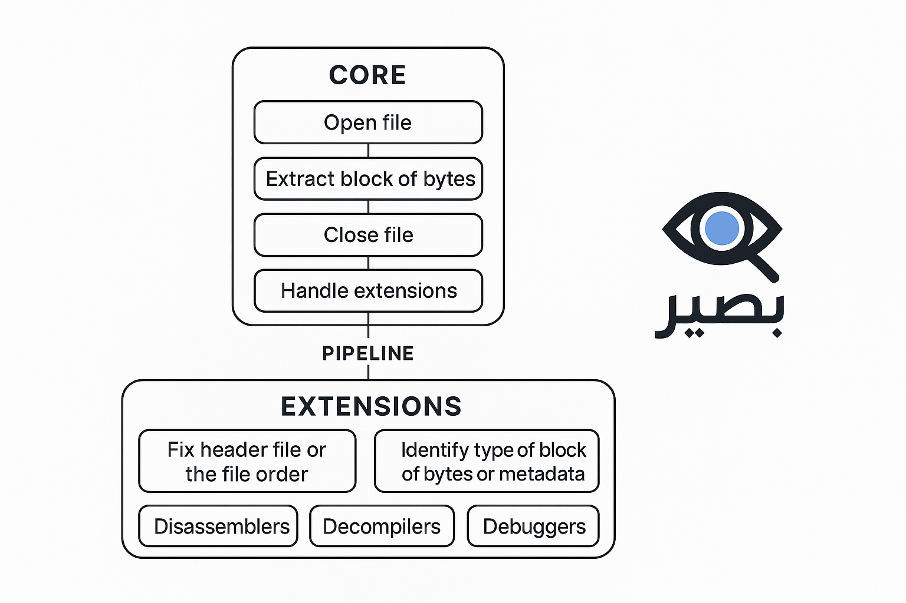

# بصير (Baseer)

**بصير (Baseer)** is a flexible, C-based reverse engineering analysis tool built on a **Core + Extensions** architecture. It can handle files from **any programming language** and allows you to open files, extract byte blocks, and analyze them using modular, customizable extensions.

<!-- بصير (Baseer) – a high-performance, C-based tool for reverse engineering and analyzing files from any programming language. -->

---

## Architecture
 

### 1. Core

The Core handles the essential operations:

- **Open File**: Read files in raw byte format.
- **Extract Byte Blocks**: load block of bytes into memory.
- **Close File**: Release resources when done.
- **Handle Extensions**: Load and manage various extensions.
- **Manage Pipeline**: Pass byte blocks through extensions sequentially or in parallel.

### 2. Extensions

Extensions add advanced capabilities:

- **Fix Header**: Repair file headers or order.
- **Identify Block Type**: Detect byte block type or metadata.
- **Disassembler**: Convert binaries to assembly instructions.
- **Decompiler**: Convert binaries to readable source code.
- **Debugger**: Dynamically monitor and analyze files.

---

## Usage

1. Compile the Core (C-based):

```bash
make
```


2. Run the Core and specify the file:
```bash
./baseer sample.bin
```


3. Enable desired extensions:
```bash
./baseer sample.bin --extensions fix_header identify_block disassembler
```


4. Use a pipeline of extensions:
```bash
./baseer sample.bin --pipeline fix_header|identify_block|disassembler
```

## Features

- Written in C for speed and low-level control.
- Language-agnostic: works with files from any programming language.
- Modular and extensible architecture.
- Supports complex analysis pipelines.
- Easy API for creating new extensions.

## Contributing

Create new extensions by inheriting from the Extension Base Class. Each extension should include:

- Extension name.
- Main function to analyze or modify byte blocks.
- Ability to integrate with the pipeline.


