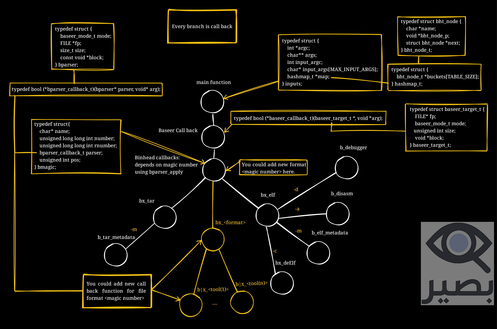

# بصير (Baseer)

**بصير (Baseer)** is a modular, extensible binary analysis framework written in C.
It allows developers to inspect, disassemble, debug, and decompile binary files using a flexible callback system.
Baseer identifies file formats using magic numbers and executes corresponding handlers dynamically.

> ⚠️ Note: This project is still under development and may change frequently.

---

## Architecture
 

### 1. Core

The Core handles the essential operations:

- **Open File**: Read files in raw byte format.
- **Extract Byte Blocks**: load block of bytes into memory.
- **Close File**: Release resources when done.
- **Handle Extensions**: Load and manage various extensions.
- **Manage Pipeline**: Pass byte blocks through extensions sequentially or in parallel.

### 2. Extensions

Extensions add advanced capabilities:

- **Fix Header**: Repair file headers or order.
- **Identify Block Type**: Detect byte block type or metadata.
- **Disassembler**: Convert binaries to assembly instructions.
- **Decompiler**: Convert binaries to readable source code.
- **Debugger**: Dynamically monitor and analyze files.


## Baseer in details
Baseer is designed around a callback tree.
Each file format (e.g., ELF, TAR, etc.) is represented by a branch that defines its own callbacks.
Callbacks can perform operations such as reading metadata, disassembling, debugging, or decompiling.

### Baseer Architecture Diagram



### Key Concepts
- `bparser` — the main parser structure that holds file information.
- `bmagic` — defines a magic number, the file type name, and the function callback used for parsing.
- `inputs` — holds runtime arguments and a hashmap for communication between callbacks.
- `bparser_apply()` — dispatches the execution of a callback for a given format.
- Callbacks (`bx_<format>`) — per-format handler (e.g., `bx_elf`, `bx_tar`) that interprets command-line flags.
- Tools (`b_<tool>`) — actions executed by callbacks, such as `b_debugger`, `b_disasm`, `b_elf_metadata`, etc.

Each branch in the diagram represents a callback path from the main function → Baseer callback → format handler → specific tools.


---
[docs](./docs/html)


## Libraries Used
- **udis86**: Used for disassembling x86 and x64 architecture binaries.  
  [GitHub Repository](https://github.com/vmt/udis86)

- **RetDec**: Used as the decompiler for translating binaries into a higher-level representation.  
  [GitHub Repository](https://github.com/avast/retdec)

---
## Build Instructions

Baseer uses a standard Makefile for compilation.

### Clone the repository
```bash
git clone https://github.com/thxa/baseer.git
cd baseer
```
### Build Baseer
```bash
make
```

### Run Baseer on a binary
```
./build/baseer <target-file> -m
```

### Compile and analyze file
- 64 bit
```bash 
make && ./build/baseer examples/64bit_x86_64 -m | less -r
```

- 32 bit
```bash 
make && ./build/baseer examples/32bit_x86 -m | less -r
```


### Requirements
- GCC
- Linux environment (recommended)
- make build system


--- 
## Install Baseer 

### Installation on Arch Linux
[Baseer on AUR](https://aur.archlinux.org/packages/baseer)

You can install **Baseer** from the AUR using an AUR helper like `yay`:
```bash
yay -S baseer
```
> Make sure you have an AUR helper installed (e.g., `yay`, `paru`) before running the command.

### Uninstallation
To remove **Baseer**, use:
```bash
pacman -Rs baseer
```

### Install from Source
To install **Baseer** from source:
```bash
make install
```

To uninstall:
```bash
make uninstall
```
---

## Usage

Analyze a file using one of the following modes:
- Show metadata:
```bash
baseer <file> -m
```
- Disassemble:
```bash 
baseer <file> -a
```

- Launch debugger:
```bash
baseer <file> -d
```
- Launch REPL:
```bash
baseer -i
```


<!-- 2. Run the Core and specify the file: -->
<!-- - Show metadata of a file -->
<!-- ./baseer <file> -m -->

<!-- # Disassemble a file -->
<!-- ./baseer <file> -a -->

<!-- # Launch debugger for a file -->
<!-- ./baseer <file> -d -->


<!-- 3. Enable desired extensions: -->
<!-- ```bash -->
<!-- baseer sample.bin --extensions fix_header identify_block disassembler -->
<!-- ``` -->


<!-- 4. Use a pipeline of extensions: -->
<!-- ```bash -->
<!-- baseer sample.bin --pipeline fix_header|identify_block|disassembler -->
<!-- ``` -->
---
## Features

- Written in C for speed and low-level control.
- Language-agnostic: works with files from any programming language.
- Modular and extensible architecture.
- Supports complex analysis pipelines.
- Easy API for creating new extensions.

<!-- ## Contributing -->
---
## How Baseer Works

When you run Baseer with a target file, it:

1. Reads the file header and detects its magic number.
2. Searches the `bmagic` array for a match.
3. Calls the corresponding callback (`bx_<format>`) to handle the file.
4. Executes tools (`b_<tool>`) depending on command-line flags (e.g., `-m` for metadata, `-a` for disassembly, `-d` for debugging).

### Example of the format registration:
```c
bmagic magics[] = {
    {"ELF", ELF_MAGIC, reverse_bytes(ELF_MAGIC), bx_elf, 0},
    {"TAR", TAR_MAGIC, reverse_bytes(TAR_MAGIC), bx_tar, 257},
    // {"PDF", PDF_MAGIC, reverse_bytes(PDF_MAGIC), NULL, 0},
    // {"PNG", PNG_MAGIC, reverse_bytes(PNG_MAGIC), NULL, 0},
    // {"ZIP", ZIP_MAGIC, reverse_bytes(ZIP_MAGIC), NULL, 0},
    // {"Mach-o", MACHO_MAGIC, reverse_bytes(MACHO_MAGIC), NULL, 0},
};
```

### Example: ELF Metadata Extension

Below is an example of an already built extension that prints ELF file metadata.
```c
bool bx_elf(bparser* parser, void *arg)
{
    int argc = *((inputs*)arg)->argc;
    char** args = ((inputs*)arg)->args;

    for (int i = 2; i < argc; i++) {
        if (strcmp("-m", args[i]) == 0)
            bparser_apply(parser, print_meta_data, arg);
        else if (strcmp("-a", args[i]) == 0)
            bparser_apply(parser, print_elf_disasm, arg);
        else if (strcmp("-d", args[i]) == 0)
            bparser_apply(parser, b_debugger, arg);
        else if (strcmp("-c", args[i]) == 0)
            bparser_apply(parser, decompile_elf, arg);
        else
            fprintf(stderr, "[!] Unsupported flag: %s\n", args[i]);
    }

    return true;
}
```

<!--
Create new extensions by inheriting from the Extension Base Class. Each extension should include:

- Extension name.
- Main function to analyze or modify byte blocks.
- Ability to integrate with the pipeline.
-->

## Adding New Formats

Baseer is built to be easily extended.
To add a new format (e.g., PDF, PNG, ZIP):

1. Create a new file in modules/<format>/bx_<format>.c.
2. Define your format callback (bx_<format>).
3. Implement your tools (e.g., b_<tool1>, b_<tool2>).
4. Register your format in the bmagic array.
5. Rebuild Baseer with make.

See [CONTRIBUTING.md](./CONTRIBUTING.md) for a detailed guide.

---

## Supported File Types (Magic Numbers)

Use this checklist to see which file types Baseer can currently handle:

- [x] **ELF** - `7F 45 4C 46` (Executable and Linkable Format)
- [x] **TAR** - `75 73 74 61 72` (TAR archive)
- [ ] **PDF** - `25 50 44 46` (Portable Document Format)
- [ ] **PNG** - `89 50 4E 47 0D 0A 1A 0A` (Portable Network Graphics)
- [ ] **JPEG** - `FF D8 FF` (JPEG image)
- [ ] **GIF** - `47 49 46 38` (Graphics Interchange Format)
- [ ] **ZIP** - `50 4B 03 04` (ZIP archive)
- [ ] **RAR** - `52 61 72 21 1A 07 00` (RAR archive)
- [ ] **7Z** - `37 7A BC AF 27 1C` (7-Zip archive)
- [ ] **EXE/DOS MZ** - `4D 5A` (Windows executable)
- [ ] **Mach-O** - `CF FA ED FE` (Mac OS X executable)
- [ ] **TIFF** - `49 49 2A 00` / `4D 4D 00 2A` (Tagged Image File Format)
- [ ] **MP3** - `49 44 33` (MP3 audio)
- [ ] **WAV** - `52 49 46 46` (Waveform Audio File)
- [ ] **BMP** - `42 4D` (Bitmap image)
- [ ] **ISO** - `43 44 30 30 31` (ISO 9660 CD-ROM image)
- [ ] **GZIP** - `1F 8B` (GZIP compressed)
- [ ] **FLAC** - `66 4C 61 43` (Free Lossless Audio Codec)
- [ ] **MIDI** - `4D 54 68 64` (MIDI sound file)
- [ ] **Microsoft Office (OLE)** - `D0 CF 11 E0 A1 B1 1A E1` (Word, Excel, PowerPoint)
- [ ] **Android APK** - `50 4B 03 04` (ZIP-based APK archive)
- [ ] **VMware Disk (VMDK)** - `4B 44 4D` (Virtual Machine Disk)
- [ ] **WebAssembly** - `00 61 73 6D` (WASM binary)
- [ ] **SQLite** - `53 51 4C 69 74 65 20 66 69 6C 65` (SQLite database)
- [ ] **XZ** - `FD 37 7A 58 5A 00` (XZ compressed)
- [ ] **CAB** - `4D 53 43 46` (Microsoft Cabinet file)
- [ ] **LZ4** - `04 22 4D 18` (LZ4 Frame Format)

> This checklist is based on the [Wikipedia list of file signatures](https://en.wikipedia.org/wiki/List_of_file_signatures). You can extend Baseer to support more types in the future.

